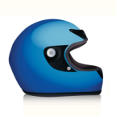

# Rider, A Motorbike Showcasing App for Android Devices

Rider is an exciting and easy to use android app that fulfills the purpose of showcasing different motorbikes to a user, including images, model attributes, and further descriptions of the bike. With 50 bikes already in the system, this serves as a great start for both the motorbike enthusiast and new rider to find out more about different bikes, and discover different bikes they hadn't seen before. The app is expected to grow its database of bikes, while maintaining its visual appeal and clear organizational structure, making it a first-of-its-kind in the motorbiking space.

## Usage

Rider can currently be installed using Android Studio, with the possibility of a release on the play store in the future. The examples below show some of the key functionalities.

Rider opens up to a homepage which contains a search feature, a 'most viewed bikes' category which is updated on use, and a bike category selector, with 5 unique categories present. Opening a category or inputting a search brings you to a list activity listing all the motorbikes in an easy to see and visually appealing manner. The details activity of each bike presents an automated image slider, bike details, and further information about the bike. Animations and transitions make this a smooth process for the user.

### Project Use

* [Android Studio](https://developer.android.com/studio) - Used for development and testing of the app
* [IntelliJ IDEA](https://www.jetbrains.com/idea/) - Recommended IDE for Java Android App Development

## Authors

* **Paulse Anithottam** 
* **Syon Divekar** 

Feel free to reach out to our GitHub accounts if you have any suggestions/ ideas for improvements. We hope to further improve the implementation where possible.
